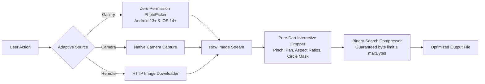
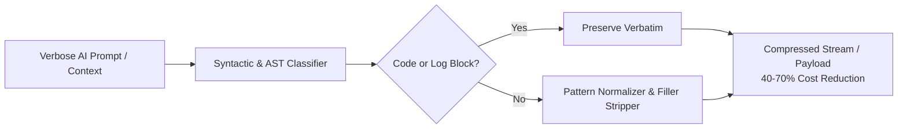
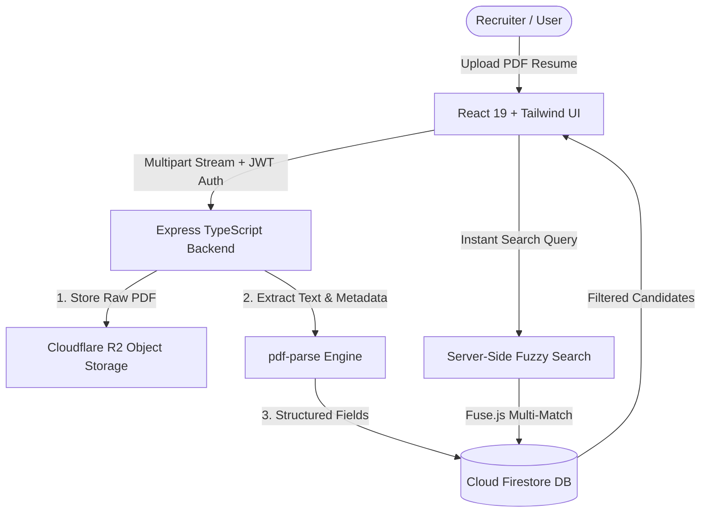

# Hi there, I'm Karan Palav 👋

<div align="left">
  <a href="https://git.io/typing-svg">
    
  </a>
</div>

<br />

<p align="left">
  <a href="https://pub.dev/publishers/karan8686/packages"></a>
  <a href="https://karan8686.github.io/caveman-plus/"></a>
  <a href="mailto:Kpalav098@gmail.com"></a>
</p>

---

## ⚡ Featured Project Spotlights

### 📸 1. [adaptive_image_picker](https://github.com/Karan8686/adaptive_image_picker) — Zero-Permission Media Picker & Cropper
> **Published Flutter / Dart Package** on [pub.dev](https://pub.dev/packages/adaptive_image_picker)  
> Solves traditional storage permission issues by pairing native zero-permission system pickers with a pure-Dart interactive cropper and binary-search file compressor.

<div align="center">

| ✂️ Pure-Dart Gesture Cropper & Filter | 📱 Full Adaptive Workflow |
| :---: | :---: |
|  |  |

</div>

#### 🏛️ Zero-Permission Architecture Flow


---

### 🪨 2. [caveman-plus](https://github.com/Karan8686/caveman-plus) — AI Token Compression Engine
> **Published npm Package & CLI** • [Try the Live Interactive Playground →](https://karan8686.github.io/caveman-plus/)  
> Programmatic text compression engine for LLMs and AI pipelines. Strips 40–70% of redundant tokens while preserving 100% of code, errors, and technical meaning.

```text
Input:  "This is basically just a really verbose sentence that could definitely be compressed quite a bit."
Output: "This is a verbose sentence that could be compressed a bit."  (-54% tokens saved)
```

#### 🔄 Token Compression Pipeline


---

### 📄 3. [CV Bucket](https://github.com/usesinspiration-ship-it/Cv_bucket) — Full-Stack Resume Platform
> **Sole Architect & Lead Developer**  
> End-to-end full-stack candidate indexing and search engine built with **React 19**, **Express**, **Cloudflare R2**, and **Firestore**.

#### ☁️ Cloud Architecture & Data Flow


---

### 🖼️ 4. [adaptive_image_loader](https://github.com/Karan8686/adaptive_image_loader) — Edge CDN Image Resolver
> **Published Flutter / Dart Package** on [pub.dev](https://pub.dev/packages/adaptive_image_loader)  
> High-performance drop-in replacement for `Image.network` that converts Google Drive and Dropbox links into direct Edge CDN streams with 0 redirects and on-the-fly server downscaling.

| Challenge with `Image.network` | `AdaptiveImage` Solution ⚡ | Impact |
| :--- | :--- | :--- |
| **Google Drive Links Fail / 302 Redirect** | Resolves directly to `lh3.googleusercontent.com` | **0 Redirects & Instant First Byte** |
| **Massive 15MB Photos cause OOM** | Edge CDN dynamic resizing parameter (`=s400`) | **Saves up to 95% device RAM** |
| **Dropbox Shared Links Show HTML Preview** | Auto-converts to raw media stream (`?dl=1`) | **Zero broken images** |
| **Re-downloading on every view** | Built-in disk cache with programmatic eviction | **Offline-ready caching** |

---

## 🛠️ Tech Stack & Capabilities

<table>
  <tr>
    <td align="center" width="180"><strong>Mobile & Cross-Platform</strong></td>
    <td>
      
      
      
      
    </td>
  </tr>
  <tr>
    <td align="center"><strong>Frontend & Web</strong></td>
    <td>
      
      
      
      
    </td>
  </tr>
  <tr>
    <td align="center"><strong>Backend, Cloud & APIs</strong></td>
    <td>
      
      
      
      
      
    </td>
  </tr>
</table>

---

## 📊 GitHub Analytics

<div align="center">
  
  &nbsp;
  
</div>

<div align="center" style="margin-top: 10px;">
  
</div>

---

## 📬 Connect & Collaborate

<div align="left">
  <a href="mailto:Kpalav098@gmail.com">
    
  </a>
  &nbsp;
  <a href="https://github.com/Karan8686">
    
  </a>
  &nbsp;
  <a href="https://karan8686.github.io/caveman-plus/">
    
  </a>
</div>
